# 🏗️ Arquitectura Técnica Detallada

## 📋 Índice

1. [Visión General](#visión-general)
2. [Arquitectura de Capas](#arquitectura-de-capas)
3. [Patrones de Diseño](#patrones-de-diseño)
4. [Flujos de Datos](#flujos-de-datos)
5. [Decisiones Técnicas](#decisiones-técnicas)
6. [Seguridad](#seguridad)
7. [Performance y Escalabilidad](#performance-y-escalabilidad)
8. [Monitoreo y Observabilidad](#monitoreo-y-observabilidad)

## 🎯 Visión General

Este proyecto implementa una **API RESTful para eCommerce** siguiendo principios de **Clean Architecture**, **SOLID**, y **Domain-Driven Design (DDD)**. La arquitectura está diseñada para ser:

- ✅ **Escalable**: Soporta crecimiento horizontal y vertical
- ✅ **Mantenible**: Código limpio y bien estructurado
- ✅ **Testeable**: Cada componente es testeable de forma aislada
- ✅ **Segura**: Múltiples capas de seguridad implementadas
- ✅ **Observable**: Logging y métricas completas

## 🏛️ Arquitectura de Capas

### Diagrama de Arquitectura

```mermaid
graph TB
    subgraph "🌐 Presentation Layer"
        A[Controllers] --> B[DTOs]
        A --> C[Swagger Docs]
    end
    
    subgraph "🔒 Security Layer"
        D[Guards] --> E[JWT Strategy]
        D --> F[Roles Guard]
        D --> G[Rate Limiting]
    end
    
    subgraph "💼 Business Layer"
        H[Services] --> I[Domain Logic]
        H --> J[External APIs]
        H --> K[Cron Jobs]
    end
    
    subgraph "🗄️ Data Layer"
        L[Prisma ORM] --> M[PostgreSQL]
        L --> N[Migrations]
        L --> O[Schema]
    end
    
    subgraph "🔧 Infrastructure"
        P[Docker] --> Q[Nginx]
        P --> R[Redis]
        P --> S[Logging]
    end
    
    A --> D
    D --> H
    H --> L
    L --> P
```



### Responsabilidades por Capa

#### 🌐 **Presentation Layer (Controladores)**
- **Responsabilidad**: Manejo de HTTP requests/responses
- **Componentes**: Controllers, DTOs, Swagger decorators
- **Principios**: 
  - Validación de entrada con `class-validator`
  - Transformación de datos con DTOs
  - Documentación automática con Swagger

```typescript
@ApiTags('Products')
@Controller('products')
export class ProductsController {
  @Get()
  @ApiOperation({ summary: 'Get products with filters' })
  async findAll(@Query() query: ProductQueryDto) {
    return this.productsService.findAll(query);
  }
}
```

#### 🔒 **Security Layer (Seguridad)**
- **Responsabilidad**: Autenticación, autorización y protección
- **Componentes**: Guards, Strategies, Middleware
- **Implementaciones**:
  - JWT Authentication con Passport
  - Role-based Authorization
  - Rate Limiting con Throttler
  - Input Validation

```typescript
@UseGuards(JwtAuthGuard, RolesGuard)
@Roles(UserRole.ADMIN)
@ApiBearerAuth()
export class AdminController {
  // Solo administradores pueden acceder
}
```

#### 💼 **Business Layer (Lógica de Negocio)**
- **Responsabilidad**: Reglas de negocio y orquestación
- **Componentes**: Services, Domain entities, Business rules
- **Características**:
  - Independiente de frameworks
  - Lógica de dominio encapsulada
  - Validaciones de negocio

```typescript
@Injectable()
export class CartService {
  async addItemToCart(userId: string, item: AddToCartDto) {
    // 1. Validar stock disponible
    // 2. Verificar límites del carrito
    // 3. Calcular precios y descuentos
    // 4. Actualizar carrito
    // 5. Registrar evento
  }
}
```

#### 🗄️ **Data Layer (Acceso a Datos)**
- **Responsabilidad**: Persistencia y consultas de datos
- **Componentes**: Prisma ORM, Schemas, Migrations
- **Ventajas**:
  - Type-safe queries
  - Migraciones automáticas
  - Connection pooling
  - Query optimization

```typescript
async findProductsWithFilters(filters: ProductFilters) {
  return this.prisma.product.findMany({
    where: {
      isActive: true,
      ...(filters.category && { 
        category: { slug: filters.category } 
      }),
      ...(filters.search && {
        OR: [
          { title: { contains: filters.search, mode: 'insensitive' } },
          { description: { contains: filters.search, mode: 'insensitive' } }
        ]
      })
    },
    include: { category: true },
    skip: filters.skip,
    take: filters.limit
  });
}
```

## 🎨 Patrones de Diseño

### 1. **Repository Pattern**
Abstrae el acceso a datos y permite testing con mocks.

```typescript
interface IProductRepository {
  findById(id: string): Promise<Product>;
  findAll(filters: ProductFilters): Promise<Product[]>;
  create(data: CreateProductDto): Promise<Product>;
  update(id: string, data: UpdateProductDto): Promise<Product>;
}

@Injectable()
export class ProductsService implements IProductRepository {
  constructor(private prisma: PrismaService) {}
  // Implementación...
}
```

### 2. **Strategy Pattern**
Múltiples estrategias de autenticación intercambiables.

```typescript
// Estrategia JWT
@Injectable()
export class JwtStrategy extends PassportStrategy(Strategy) {
  async validate(payload: JwtPayload) {
    return { id: payload.sub, email: payload.email, role: payload.role };
  }
}

// Estrategia Local
@Injectable()
export class LocalStrategy extends PassportStrategy(Strategy, 'local') {
  async validate(email: string, password: string) {
    return this.authService.validateUser(email, password);
  }
}
```

### 3. **Factory Pattern**
Creación consistente de objetos complejos.

```typescript
export class AuthResponseFactory {
  static create(user: User, tokens: TokenPair): AuthResponseDto {
    return {
      user: {
        id: user.id,
        email: user.email,
        firstName: user.firstName,
        lastName: user.lastName,
        role: user.role,
        isActive: user.isActive,
        createdAt: user.createdAt
      },
      ...tokens
    };
  }
}
```

### 4. **Observer Pattern**
Cron jobs como observadores de eventos temporales.

```typescript
@Injectable()
export class TasksService {
  @Cron(CronExpression.EVERY_12_HOURS)
  async handleProductSync() {
    this.logger.log('Starting scheduled product sync');
    const result = await this.productsService.syncProductsFromDummyJSON();
    this.logger.log(`Sync completed: ${result.synchronized} products`);
  }
}
```

### 5. **Decorator Pattern**
Funcionalidad transversal con decoradores.

```typescript
// Decorador personalizado para logging automático
export function LogExecution(target: any, propertyName: string, descriptor: PropertyDescriptor) {
  const method = descriptor.value;
  descriptor.value = async function (...args: any[]) {
    const start = Date.now();
    try {
      const result = await method.apply(this, args);
      const duration = Date.now() - start;
      console.log(`${propertyName} executed in ${duration}ms`);
      return result;
    } catch (error) {
      console.error(`${propertyName} failed:`, error);
      throw error;
    }
  };
}
```

## 🔄 Flujos de Datos

### Flujo de Autenticación


### Flujo de Sincronización de Productos


### Flujo de Carrito de Compras


## 🔧 Decisiones Técnicas Justificadas

### Base de Datos: PostgreSQL vs Alternativas

| Criterio | PostgreSQL | MySQL | MongoDB |
|----------|------------|-------|---------|
| **ACID Compliance** | ✅ Completo | ✅ Completo | ❌ Eventual |
| **JSON Support** | ✅ Nativo | ⚠️ Limitado | ✅ Nativo |
| **Escalabilidad** | ✅ Horizontal/Vertical | ⚠️ Principalmente Vertical | ✅ Horizontal |
| **Índices Avanzados** | ✅ GIN, GiST, B-tree | ⚠️ B-tree principalmente | ✅ Múltiples tipos |
| **Costo** | ✅ Open Source | ✅ Open Source | ⚠️ Licencias comerciales |
| **Ecosistema** | ✅ Maduro | ✅ Maduro | ✅ Moderno |

**Decisión**: PostgreSQL por su balance entre funcionalidades avanzadas, performance y costo.

### ORM: Prisma vs Alternativas

| Criterio | Prisma | TypeORM | Sequelize |
|----------|--------|---------|-----------|
| **Type Safety** | ✅ Completo | ⚠️ Parcial | ❌ Limitado |
| **Performance** | ✅ Query Engine | ⚠️ Bueno | ⚠️ Bueno |
| **Migraciones** | ✅ Automáticas | ⚠️ Manuales | ⚠️ Manuales |
| **Developer Experience** | ✅ Excelente | ⚠️ Bueno | ❌ Regular |
| **Introspección** | ✅ Prisma Studio | ❌ No | ❌ No |
| **Generación de Tipos** | ✅ Automática | ⚠️ Manual | ❌ No |

**Decisión**: Prisma por su developer experience superior y type safety completo.

### Framework: NestJS vs Alternativas

| Criterio | NestJS | Express | Fastify |
|----------|--------|---------|---------|
| **Arquitectura** | ✅ Modular/DI | ❌ Minimalista | ❌ Minimalista |
| **TypeScript** | ✅ Nativo | ⚠️ Configuración | ⚠️ Configuración |
| **Ecosystem** | ✅ Integrado | ⚠️ Manual | ⚠️ Manual |
| **Testing** | ✅ Built-in | ⚠️ Manual | ⚠️ Manual |
| **Documentation** | ✅ Swagger Auto | ❌ Manual | ❌ Manual |
| **Performance** | ⚠️ Bueno | ✅ Excelente | ✅ Excelente |

**Decisión**: NestJS por su arquitectura escalable y productividad de desarrollo.

## 🔒 Arquitectura de Seguridad

### Capas de Seguridad Implementadas

```
┌─────────────────────────────────────────┐
│           🌐 Client Request             │
└─────────────────┬───────────────────────┘
                  │
┌─────────────────▼───────────────────────┐
│        🚦 Rate Limiting Layer          │
│     • ThrottlerGuard (10 req/min)      │
│     • IP-based limiting                 │
└─────────────────┬───────────────────────┘
                  │
┌─────────────────▼───────────────────────┐
│       🔍 Validation Layer              │
│     • class-validator DTOs             │
│     • Input sanitization               │
│     • Type checking                    │
└─────────────────┬───────────────────────┘
                  │
┌─────────────────▼───────────────────────┐
│      🛡️ Authentication Layer          │
│     • JWT token validation             │
│     • Passport strategies              │
│     • Token expiration                 │
└─────────────────┬───────────────────────┘
                  │
┌─────────────────▼───────────────────────┐
│      👮 Authorization Layer            │
│     • Role-based access control        │
│     • Resource-level permissions       │
│     • Method-level guards              │
└─────────────────┬───────────────────────┘
                  │
┌─────────────────▼───────────────────────┐
│       💼 Business Logic Layer          │
│     • Domain validations               │
│     • Business rules enforcement       │
│     • Data integrity checks            │
└─────────────────┬───────────────────────┘
                  │
┌─────────────────▼───────────────────────┐
│        🗄️ Data Access Layer           │
│     • Parameterized queries            │
│     • SQL injection prevention         │
│     • Connection pooling               │
└─────────────────────────────────────────┘
```

### Implementación de Seguridad

#### 1. **Rate Limiting**
```typescript
@Module({
  imports: [
    ThrottlerModule.forRoot({
      ttl: 60, // 60 segundos
      limit: 10, // 10 requests por TTL
    }),
  ],
})
export class AppModule {}
```

#### 2. **JWT Security**
```typescript
@Injectable()
export class JwtStrategy extends PassportStrategy(Strategy) {
  constructor(private configService: ConfigService) {
    super({
      jwtFromRequest: ExtractJwt.fromAuthHeaderAsBearerToken(),
      ignoreExpiration: false, // Verificar expiración
      secretOrKey: configService.get<string>('JWT_SECRET'),
    });
  }
}
```

#### 3. **Input Validation**
```typescript
export class CreateProductDto {
  @IsString()
  @IsNotEmpty()
  @Length(1, 255)
  @Transform(({ value }) => value?.trim())
  title: string;

  @IsNumber()
  @Min(0)
  @Max(999999.99)
  price: number;
}
```

#### 4. **SQL Injection Prevention**
```typescript
// Prisma usa queries parametrizadas automáticamente
const products = await this.prisma.product.findMany({
  where: {
    title: {
      contains: searchTerm, // Automáticamente escapado
      mode: 'insensitive'
    }
  }
});
```

## 📈 Performance y Escalabilidad

### Optimizaciones Implementadas

#### 1. **Database Optimizations**
```sql
-- Índices para búsquedas frecuentes
CREATE INDEX idx_products_title ON products USING gin(to_tsvector('english', title));
CREATE INDEX idx_products_category ON products(category_id);
CREATE INDEX idx_products_active ON products(is_active) WHERE is_active = true;
CREATE INDEX idx_users_email ON users(email);
CREATE INDEX idx_cart_user ON carts(user_id);
```

#### 2. **Query Optimization**
```typescript
// Paginación eficiente
async findProducts(query: ProductQueryDto) {
  const { skip = 0, limit = 10 } = query;
  
  const [products, total] = await Promise.all([
    this.prisma.product.findMany({
      skip,
      take: limit,
      include: {
        category: {
          select: { id: true, name: true, slug: true }
        }
      },
      orderBy: { createdAt: 'desc' }
    }),
    this.prisma.product.count({ where: filters })
  ]);
  
  return { products, total, hasNext: skip + limit < total };
}
```

#### 3. **Connection Pooling**
```typescript
// Configuración de Prisma para connection pooling
const prisma = new PrismaClient({
  datasources: {
    db: {
      url: `${DATABASE_URL}?connection_limit=20&pool_timeout=20`
    }
  }
});
```

#### 4. **Caching Strategy**
```typescript
@Injectable()
export class ProductsService {
  private cache = new Map<string, { data: any; timestamp: number }>();
  private CACHE_TTL = 5 * 60 * 1000; // 5 minutos

  async getPopularProducts() {
    const cacheKey = 'popular_products';
    const cached = this.cache.get(cacheKey);
    
    if (cached && Date.now() - cached.timestamp < this.CACHE_TTL) {
      return cached.data;
    }
    
    const products = await this.prisma.product.findMany({
      where: { isActive: true },
      orderBy: { rating: 'desc' },
      take: 10
    });
    
    this.cache.set(cacheKey, { data: products, timestamp: Date.now() });
    return products;
  }
}
```

### Preparación para Escalabilidad

#### 1. **Horizontal Scaling**
```yaml
# docker-compose.scale.yml
version: '3.8'
services:
  app:
    build: .
    deploy:
      replicas: 3
    environment:
      - NODE_ENV=production
      - DATABASE_URL=${DATABASE_URL}
  
  nginx:
    image: nginx:alpine
    ports:
      - "80:80"
    depends_on:
      - app
    volumes:
      - ./nginx/nginx.conf:/etc/nginx/nginx.conf
```

#### 2. **Load Balancing**
```nginx
# nginx/nginx.conf
upstream app_servers {
    server app_1:3000;
    server app_2:3000;
    server app_3:3000;
}

server {
    listen 80;
    
    location / {
        proxy_pass http://app_servers;
        proxy_set_header Host $host;
        proxy_set_header X-Real-IP $remote_addr;
    }
}
```

#### 3. **Database Scaling**
```yaml
# Master-Slave PostgreSQL setup
services:
  postgres-master:
    image: postgres:15
    environment:
      POSTGRES_REPLICATION_MODE: master
      POSTGRES_REPLICATION_USER: replicator
      POSTGRES_REPLICATION_PASSWORD: replicator_password
  
  postgres-slave:
    image: postgres:15
    environment:
      POSTGRES_REPLICATION_MODE: slave
      POSTGRES_MASTER_HOST: postgres-master
      POSTGRES_REPLICATION_USER: replicator
      POSTGRES_REPLICATION_PASSWORD: replicator_password
```

## 🔍 Monitoreo y Observabilidad

### Logging Estructurado

```typescript
@Injectable()
export class LoggerService {
  private logger = winston.createLogger({
    level: process.env.LOG_LEVEL || 'info',
    format: winston.format.combine(
      winston.format.timestamp(),
      winston.format.errors({ stack: true }),
      winston.format.json()
    ),
    transports: [
      new winston.transports.File({ filename: 'logs/error.log', level: 'error' }),
      new winston.transports.File({ filename: 'logs/combined.log' }),
      new winston.transports.Console({
        format: winston.format.combine(
          winston.format.colorize(),
          winston.format.simple()
        )
      })
    ]
  });

  log(message: string, context?: string, metadata?: any) {
    this.logger.info(message, { context, ...metadata });
  }

  error(message: string, trace?: string, context?: string, metadata?: any) {
    this.logger.error(message, { trace, context, ...metadata });
  }
}
```

### Métricas de Performance

```typescript
@Injectable()
export class MetricsService {
  private metrics = {
    requests: new Map<string, number>(),
    responseTimes: new Map<string, number[]>(),
    errors: new Map<string, number>()
  };

  recordRequest(endpoint: string, responseTime: number, statusCode: number) {
    // Incrementar contador de requests
    const currentCount = this.metrics.requests.get(endpoint) || 0;
    this.metrics.requests.set(endpoint, currentCount + 1);

    // Registrar tiempo de respuesta
    const times = this.metrics.responseTimes.get(endpoint) || [];
    times.push(responseTime);
    this.metrics.responseTimes.set(endpoint, times);

    // Registrar errores
    if (statusCode >= 400) {
      const errorCount = this.metrics.errors.get(endpoint) || 0;
      this.metrics.errors.set(endpoint, errorCount + 1);
    }
  }

  getMetrics() {
    return {
      requests: Object.fromEntries(this.metrics.requests),
      averageResponseTimes: this.calculateAverageResponseTimes(),
      errorRates: this.calculateErrorRates()
    };
  }
}
```

### Health Checks

```typescript
@Controller('health')
export class HealthController {
  constructor(
    private prisma: PrismaService,
    private configService: ConfigService
  ) {}

  @Get()
  async check() {
    const checks = await Promise.allSettled([
      this.checkDatabase(),
      this.checkExternalAPI(),
      this.checkMemoryUsage()
    ]);

    const results = checks.map((check, index) => ({
      name: ['database', 'external_api', 'memory'][index],
      status: check.status === 'fulfilled' ? 'healthy' : 'unhealthy',
      details: check.status === 'fulfilled' ? check.value : check.reason
    }));

    const overallStatus = results.every(r => r.status === 'healthy') 
      ? 'healthy' 
      : 'unhealthy';

    return {
      status: overallStatus,
      timestamp: new Date().toISOString(),
      checks: results
    };
  }

  private async checkDatabase() {
    const start = Date.now();
    await this.prisma.$queryRaw`SELECT 1`;
    return { responseTime: Date.now() - start };
  }
}
```

---

*Esta documentación técnica proporciona una visión completa de la arquitectura, patrones y decisiones técnicas implementadas en el proyecto eCommerce API.*
