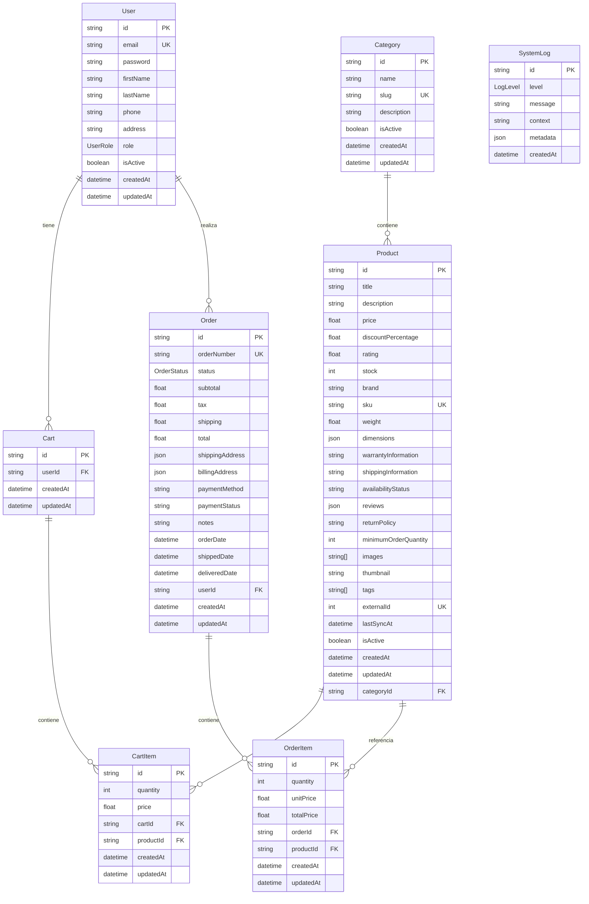

# 📊 Diagrama ER - Base de Datos eCommerce

## 🗂️ Esquema de la Base de Datos

Este diagrama muestra las relaciones entre las entidades principales del sistema de eCommerce.

## 📋 Descripción de las Entidades

### 👤 **User (Usuario)**
- **Propósito**: Gestiona la información de los usuarios del sistema
- **Roles**: CUSTOMER (cliente) y ADMIN (administrador)
- **Relaciones**: 
  - Un usuario puede tener un carrito
  - Un usuario puede realizar múltiples órdenes

### 🏷️ **Category (Categoría)**
- **Propósito**: Organiza los productos en categorías
- **Características**: Slug único para URLs amigables
- **Relaciones**: Una categoría puede contener múltiples productos

### 📦 **Product (Producto)**
- **Propósito**: Almacena información detallada de los productos
- **Sincronización**: Se sincroniza automáticamente con DummyJSON API
- **Características**: 
  - Stock management
  - Información completa (dimensiones, garantía, envío, etc.)
  - Imágenes y thumbnails
  - Tags para búsqueda
- **Relaciones**: 
  - Pertenece a una categoría
  - Puede estar en múltiples carritos
  - Puede estar en múltiples órdenes

### 🛒 **Cart (Carrito)**
- **Propósito**: Carrito de compras temporal del usuario
- **Características**: Un carrito por usuario
- **Relaciones**: 
  - Pertenece a un usuario
  - Contiene múltiples items

### 🛍️ **CartItem (Item del Carrito)**
- **Propósito**: Representa un producto específico en el carrito
- **Características**: 
  - Cantidad y precio al momento de agregar
  - Constraint único: un producto solo puede estar una vez por carrito
- **Relaciones**: 
  - Pertenece a un carrito
  - Referencia a un producto

### 📋 **Order (Orden)**
- **Propósito**: Representa una compra completada
- **Estados**: PENDING, CONFIRMED, SHIPPED, DELIVERED, CANCELLED
- **Características**: 
  - Número de orden único
  - Información completa de facturación y envío
  - Tracking de fechas (orden, envío, entrega)
- **Relaciones**: 
  - Pertenece a un usuario
  - Contiene múltiples items

### 📦 **OrderItem (Item de la Orden)**
- **Propósito**: Representa un producto específico en una orden
- **Características**: Precio congelado al momento de la compra
- **Relaciones**: 
  - Pertenece a una orden
  - Referencia a un producto

### 📊 **SystemLog (Log del Sistema)**
- **Propósito**: Registro centralizado de eventos del sistema
- **Niveles**: DEBUG, INFO, WARN, ERROR
- **Características**: 
  - Contexto y metadata en JSON
  - Limpieza automática de logs antiguos

## 🔗 Relaciones Principales

1. **Usuario → Carrito**: Relación 1:1 (un usuario, un carrito)
2. **Usuario → Órdenes**: Relación 1:N (un usuario, múltiples órdenes)
3. **Categoría → Productos**: Relación 1:N (una categoría, múltiples productos)
4. **Carrito → Items**: Relación 1:N (un carrito, múltiples items)
5. **Orden → Items**: Relación 1:N (una orden, múltiples items)
6. **Producto → CartItems**: Relación 1:N (un producto en múltiples carritos)
7. **Producto → OrderItems**: Relación 1:N (un producto en múltiples órdenes)

## 🔒 Constraints y Validaciones

- **Emails únicos** para usuarios
- **SKUs únicos** para productos
- **Slugs únicos** para categorías
- **Números de orden únicos**
- **Un producto por carrito** (constraint único en CartItem)
- **Soft deletes** con campo `isActive`
- **Timestamps automáticos** en todas las entidades

## 📈 Optimizaciones

- **Índices** en campos de búsqueda frecuente
- **Relaciones optimizadas** con foreign keys
- **Paginación** implementada en consultas
- **Caching** de productos sincronizados
- **Limpieza automática** de logs antiguos
