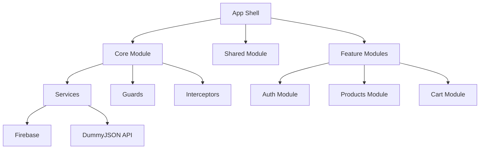
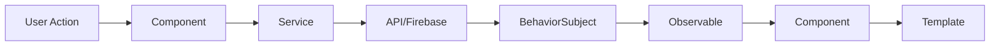
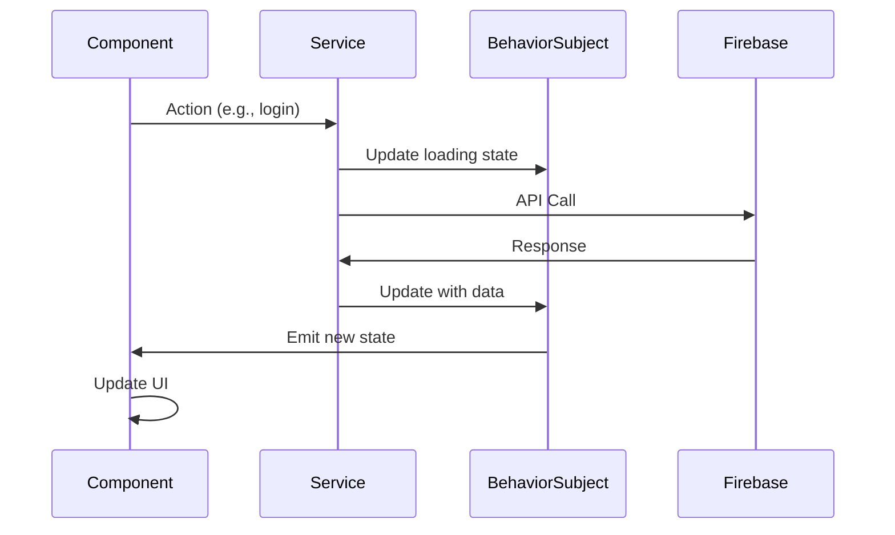
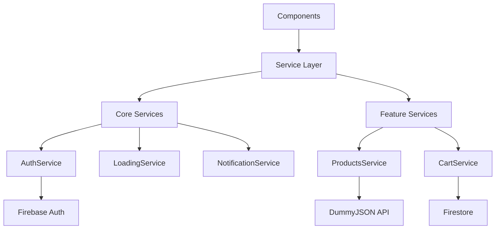
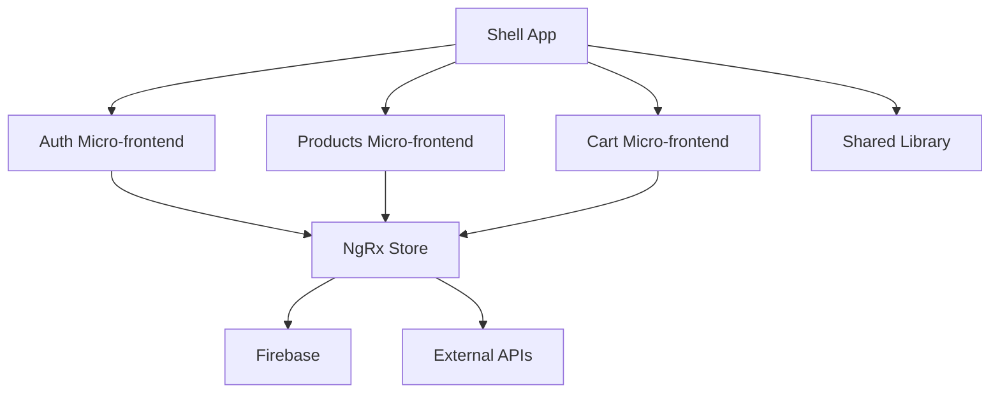

# 🏗 Arquitectura Técnica - eCommerce Frontend

## 📋 **Índice**

- [Visión General](#-visión-general)
- [Principios de Diseño](#-principios-de-diseño)
- [Arquitectura de Componentes](#-arquitectura-de-componentes)
- [Flujo de Datos](#-flujo-de-datos)
- [Gestión de Estado](#-gestión-de-estado)
- [Routing y Navegación](#-routing-y-navegación)
- [Servicios y Dependencias](#-servicios-y-dependencias)
- [Seguridad](#-seguridad)
- [Rendimiento](#-rendimiento)
- [Patrones Implementados](#-patrones-implementados)

## 🎯 **Visión General**

La aplicación sigue una **arquitectura modular y escalable** basada en los principios de Angular, con separación clara de responsabilidades y alta cohesión.

### **Arquitectura de Alto Nivel**



## 🎨 **Principios de Diseño**

### **1. Single Responsibility Principle (SRP)**
- Cada componente tiene una responsabilidad específica
- Servicios especializados para cada dominio
- Separación clara entre presentación y lógica de negocio

### **2. Open/Closed Principle (OCP)**
- Componentes abiertos para extensión, cerrados para modificación
- Uso de interfaces para abstraer implementaciones
- Inyección de dependencias para flexibilidad

### **3. Dependency Inversion Principle (DIP)**
- Dependencias inyectadas, no instanciadas directamente
- Uso de abstracciones (interfaces) en lugar de implementaciones concretas
- Inversión de control a través del DI de Angular

### **4. Don't Repeat Yourself (DRY)**
- Componentes reutilizables en Shared Module
- Servicios singleton para lógica compartida
- Utilidades y helpers centralizados

## 🧩 **Arquitectura de Componentes**

### **Jerarquía de Componentes**

```
AppComponent (Shell)
├── HeaderComponent (Navigation)
├── RouterOutlet (Content)
│   ├── HomeComponent
│   │   ├── HeroSection
│   │   ├── ProductCarousel
│   │   └── FeaturesSection
│   ├── ProductsListComponent
│   │   ├── SearchFilters
│   │   ├── ProductGrid
│   │   └── Pagination
│   ├── ProductDetailComponent
│   │   ├── ProductImages
│   │   ├── ProductInfo
│   │   └── AddToCartSection
│   ├── CartComponent
│   │   ├── CartItems
│   │   └── CartSummary
│   ├── LoginComponent
│   └── RegisterComponent
└── FooterComponent
```

### **Tipos de Componentes**

#### **Smart Components (Containers)**
- Manejan estado y lógica de negocio
- Se comunican con servicios
- Pasan datos a componentes presentacionales

```typescript
// Ejemplo: ProductsListComponent
@Component({...})
export class ProductsListComponent implements OnInit {
  products$ = this.productsService.products$;
  loading$ = this.productsService.loading$;
  
  constructor(private productsService: ProductsService) {}
  
  onSearch(term: string): void {
    this.productsService.searchProducts(term);
  }
}
```

#### **Dumb Components (Presentational)**
- Solo reciben datos via @Input()
- Emiten eventos via @Output()
- No tienen dependencias de servicios

```typescript
// Ejemplo: ProductCardComponent
@Component({...})
export class ProductCardComponent {
  @Input() product!: Product;
  @Output() addToCart = new EventEmitter<Product>();
  
  onAddToCart(): void {
    this.addToCart.emit(this.product);
  }
}
```

## 🔄 **Flujo de Datos**

### **Patrón Unidireccional**



### **Ejemplo de Flujo: Agregar al Carrito**

1. **User Action**: Click en "Agregar al Carrito"
2. **Component**: `onAddToCart(product)`
3. **Service**: `cartService.addToCart(product)`
4. **Firebase**: Actualizar documento en Firestore
5. **BehaviorSubject**: `cartItems$.next(newItems)`
6. **Observable**: Componentes suscritos reciben actualización
7. **Template**: UI se actualiza automáticamente

## 🗄 **Gestión de Estado**

### **Estrategia: BehaviorSubject + Services**

#### **¿Por qué BehaviorSubject?**

```typescript
// Ventajas del patrón implementado
class ProductsService {
  private productsSubject = new BehaviorSubject<Product[]>([]);
  public products$ = this.productsSubject.asObservable();
  
  // ✅ Estado inicial garantizado
  // ✅ Múltiples suscriptores
  // ✅ Último valor siempre disponible
  // ✅ Fácil testing con mocks
}
```

#### **Estados Gestionados**

```typescript
// AuthService - Estado de Autenticación
interface AuthState {
  user: User | null;
  loading: boolean;
  error: string | null;
}

// ProductsService - Estado de Productos
interface ProductsState {
  products: Product[];
  categories: Category[];
  loading: boolean;
  error: string | null;
  filters: ProductFilters;
}

// CartService - Estado del Carrito
interface CartState {
  items: CartItem[];
  totalItems: number;
  totalAmount: number;
  loading: boolean;
}
```

### **Flujo de Estado**



## 🗺 **Routing y Navegación**

### **Estructura de Rutas**

```typescript
const routes: Routes = [
  // Ruta raíz
  { path: '', component: HomeComponent },
  
  // Rutas de autenticación (lazy)
  {
    path: 'auth',
    loadChildren: () => import('./features/auth/auth.module').then(m => m.AuthModule)
  },
  
  // Rutas de productos (lazy)
  {
    path: 'products',
    loadChildren: () => import('./features/products/products.module').then(m => m.ProductsModule)
  },
  
  // Rutas protegidas
  {
    path: 'cart',
    loadChildren: () => import('./features/cart/cart.module').then(m => m.CartModule),
    canActivate: [AuthGuard]
  },
  
  // 404
  { path: '**', component: NotFoundComponent }
];
```

### **Guards Implementados**

#### **AuthGuard**
```typescript
@Injectable()
export class AuthGuard implements CanActivate {
  constructor(
    private authService: AuthService,
    private router: Router
  ) {}
  
  canActivate(): Observable<boolean> {
    return this.authService.isAuthenticated$.pipe(
      tap(isAuth => {
        if (!isAuth) {
          this.router.navigate(['/auth/login']);
        }
      })
    );
  }
}
```

### **Lazy Loading Strategy**

- **Módulos cargados bajo demanda**
- **Reducción del bundle inicial**
- **Mejor rendimiento de carga**
- **Separación lógica de funcionalidades**

## 🔧 **Servicios y Dependencias**

### **Arquitectura de Servicios**



### **Servicios Core**

#### **AuthService**
```typescript
@Injectable({ providedIn: 'root' })
export class AuthService {
  private userSubject = new BehaviorSubject<User | null>(null);
  public user$ = this.userSubject.asObservable();
  public isAuthenticated$ = this.user$.pipe(map(user => !!user));
  
  // Métodos: login, register, logout, updateProfile
}
```

#### **LoadingService**
```typescript
@Injectable({ providedIn: 'root' })
export class LoadingService {
  private loadingSubjects = new Map<string, BehaviorSubject<boolean>>();
  
  setLoading(key: string, loading: boolean): void {
    // Gestión granular de estados de carga
  }
  
  isLoading(key: string): Observable<boolean> {
    // Observable específico por operación
  }
}
```

### **Inyección de Dependencias**

```typescript
// Configuración en app.config.ts
export const appConfig: ApplicationConfig = {
  providers: [
    // Angular providers
    provideRouter(routes),
    provideHttpClient(withInterceptors([
      loadingInterceptor,
      errorInterceptor
    ])),
    
    // Firebase providers
    provideFirebaseApp(() => initializeApp(environment.firebase)),
    provideAuth(() => getAuth()),
    provideFirestore(() => getFirestore()),
    
    // Custom providers
    { provide: 'API_URL', useValue: environment.dummyJsonApiUrl }
  ]
};
```

## 🔒 **Seguridad**

### **Autenticación y Autorización**

#### **Firebase Authentication**
- **JWT Tokens** automáticos
- **Refresh tokens** transparentes
- **Multi-factor** (futuro)

#### **Route Guards**
```typescript
// Protección de rutas sensibles
const protectedRoutes = [
  '/cart',
  '/profile',
  '/orders'
];
```

#### **Firestore Security Rules**
```javascript
// Reglas de seguridad en Firestore
rules_version = '2';
service cloud.firestore {
  match /databases/{database}/documents {
    match /carts/{userId} {
      allow read, write: if request.auth != null 
        && request.auth.uid == userId;
    }
  }
}
```

### **Validación de Datos**

#### **Input Sanitization**
```typescript
// Validación en formularios
const loginForm = this.fb.group({
  email: ['', [Validators.required, Validators.email]],
  password: ['', [Validators.required, Validators.minLength(6)]]
});
```

#### **HTTP Interceptors**
```typescript
// Interceptor de errores
@Injectable()
export class ErrorInterceptor implements HttpInterceptor {
  intercept(req: HttpRequest<any>, next: HttpHandler): Observable<HttpEvent<any>> {
    return next.handle(req).pipe(
      catchError((error: HttpErrorResponse) => {
        // Manejo centralizado de errores
        this.handleError(error);
        return throwError(error);
      })
    );
  }
}
```

## ⚡ **Rendimiento**

### **Estrategias de Optimización**

#### **1. Lazy Loading**
- Módulos cargados bajo demanda
- Reducción del bundle inicial
- Mejor First Contentful Paint (FCP)

#### **2. OnPush Change Detection**
```typescript
@Component({
  changeDetection: ChangeDetectionStrategy.OnPush
})
export class OptimizedComponent {
  // Solo se ejecuta change detection cuando:
  // - @Input() cambia
  // - Evento del template
  // - Observable emite (con async pipe)
}
```

#### **3. TrackBy Functions**
```typescript
// Optimización de *ngFor
trackByProductId(index: number, product: Product): number {
  return product.id;
}
```

#### **4. Async Pipe**
```typescript
// Suscripción automática y cleanup
template: `
  <div *ngFor="let product of products$ | async">
    {{ product.name }}
  </div>
`
```

### **Bundle Optimization**

#### **Tree Shaking**
- Eliminación de código no usado
- Imports específicos de librerías
- Dead code elimination

#### **Code Splitting**
```typescript
// Lazy loading de módulos
const routes: Routes = [
  {
    path: 'products',
    loadChildren: () => import('./products/products.module')
      .then(m => m.ProductsModule)
  }
];
```

## 🎭 **Patrones Implementados**

### **1. Observer Pattern**
```typescript
// BehaviorSubject + Observable
class DataService {
  private dataSubject = new BehaviorSubject<Data[]>([]);
  public data$ = this.dataSubject.asObservable();
  
  updateData(newData: Data[]): void {
    this.dataSubject.next(newData);
  }
}
```

### **2. Facade Pattern**
```typescript
// CartService como facade
@Injectable()
export class CartService {
  // Simplifica interacciones complejas con Firestore
  async addToCart(product: Product): Promise<void> {
    // Lógica compleja encapsulada
    await this.updateFirestore();
    this.updateLocalState();
    this.notifyComponents();
  }
}
```

### **3. Strategy Pattern**
```typescript
// Diferentes estrategias de autenticación
interface AuthStrategy {
  authenticate(credentials: any): Observable<User>;
}

class EmailPasswordStrategy implements AuthStrategy {
  authenticate(credentials: EmailPassword): Observable<User> {
    return this.firebaseAuth.signInWithEmailAndPassword(
      credentials.email, 
      credentials.password
    );
  }
}
```

### **4. Decorator Pattern**
```typescript
// HTTP Interceptors como decoradores
@Injectable()
export class LoadingInterceptor implements HttpInterceptor {
  intercept(req: HttpRequest<any>, next: HttpHandler) {
    // Decorar request con loading state
    this.loadingService.setLoading(true);
    
    return next.handle(req).pipe(
      finalize(() => this.loadingService.setLoading(false))
    );
  }
}
```

### **5. Factory Pattern**
```typescript
// Factory para crear diferentes tipos de notificaciones
@Injectable()
export class NotificationFactory {
  createNotification(type: 'success' | 'error' | 'warning', message: string) {
    switch (type) {
      case 'success':
        return new SuccessNotification(message);
      case 'error':
        return new ErrorNotification(message);
      case 'warning':
        return new WarningNotification(message);
    }
  }
}
```

## 📊 **Métricas y Monitoreo**

### **Performance Metrics**

#### **Core Web Vitals**
- **LCP (Largest Contentful Paint)**: < 2.5s
- **FID (First Input Delay)**: < 100ms
- **CLS (Cumulative Layout Shift)**: < 0.1

#### **Bundle Analysis**
```bash
# Analizar bundle size
ng build --stats-json
npx webpack-bundle-analyzer dist/stats.json
```

### **Error Tracking**

#### **Global Error Handler**
```typescript
@Injectable()
export class GlobalErrorHandler implements ErrorHandler {
  handleError(error: any): void {
    console.error('Global error:', error);
    // Enviar a servicio de monitoreo (ej: Sentry)
  }
}
```

## 🔮 **Escalabilidad**

### **Preparación para Crecimiento**

#### **1. Micro-frontends Ready**
- Módulos independientes
- Comunicación via eventos
- Shared libraries

#### **2. State Management Evolution**
```typescript
// Migración futura a NgRx
// BehaviorSubject -> NgRx Store
// Servicios -> Effects
// Componentes -> Selectors
```

#### **3. Testing Strategy**
- **Unit Tests**: Servicios y componentes
- **Integration Tests**: Flujos completos
- **E2E Tests**: Casos de uso críticos

### **Arquitectura Futura**



---

*Esta arquitectura está diseñada para ser **mantenible**, **escalable** y **performante**, siguiendo las mejores prácticas de Angular y patrones de diseño probados.*
